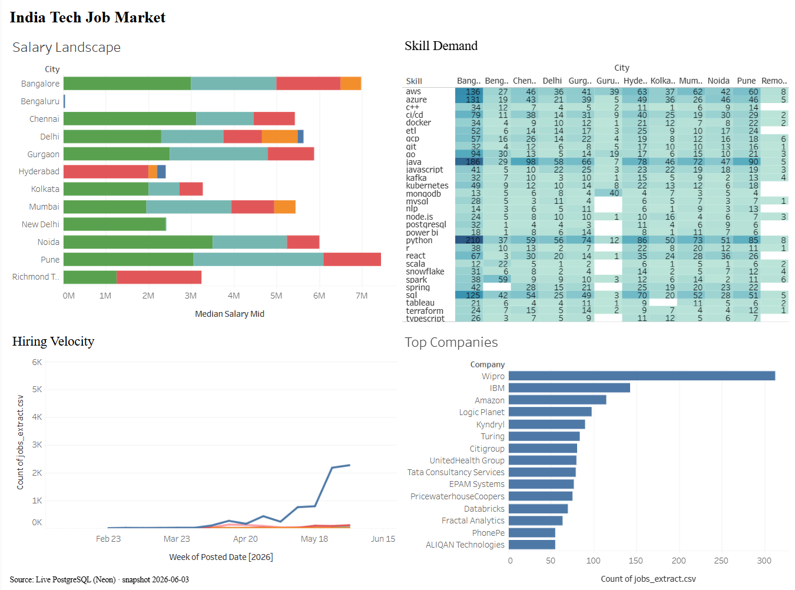
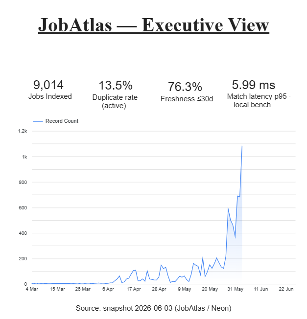
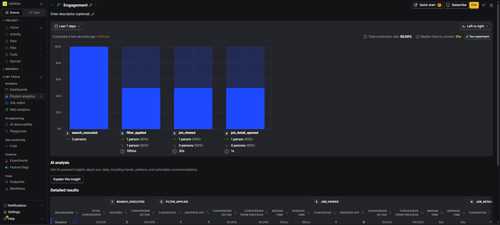
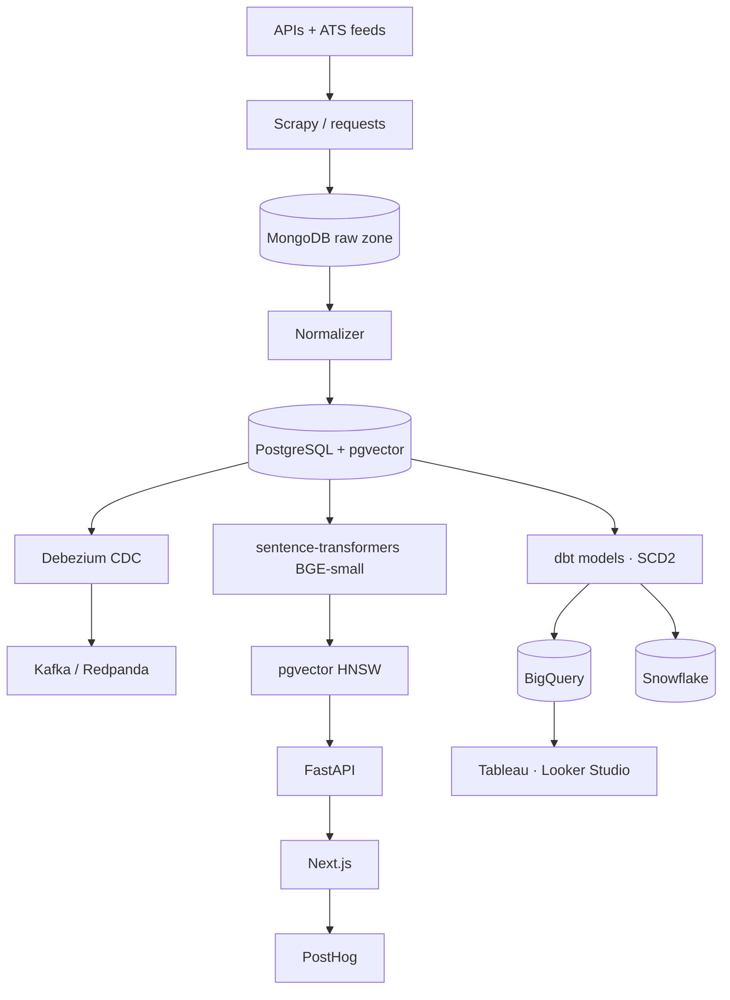

<div align="center">

# 🧭 JobAtlas

### India tech jobs, unified and matched — one search across eight job boards, deduplicated and ranked by what your resume actually says. Free to run, **₹0/month**.

[](https://github.com/ayushgupta07xx/JobAtlas/actions/workflows/ci.yml)
[](LICENSE)
[](https://www.python.org/)
[](#by-the-numbers)
[](#how-it-works)
[](#by-the-numbers)
[](#free-forever-stack)

[](#tech-stack)
[](#tech-stack)
[](#tech-stack)
[](#tech-stack)
[](#tech-stack)
[](#tech-stack)
[](#tech-stack)
[](#tech-stack)
[](#tech-stack)
[](#tech-stack)
[](#tech-stack)
[](#tech-stack)

<br/>

[](https://youtu.be/1WDMBzLdk24)

[](https://youtu.be/1WDMBzLdk24)

🌐 **[Web app](https://job-atlas-blue.vercel.app)** · 🔌 **[API docs](https://ayushgupta7777-jobatlas-api.hf.space/docs)** · 📊 **[Dashboards](#try-it--four-ways)** · 🎨 **[Wireframes](https://www.figma.com/design/Dzl2dFyb8HC5kgCXShw3Oc/JobAtlas-%E2%80%94-Wireframes?node-id=4-2&t=1wUhvodBKDhRevtv-1)**

</div>

---

The Indian tech job market is split across eight-plus portals — Naukri, Wellfound, Hirist, Instahyre, Indeed, LinkedIn, Adzuna, Jobicy. Each has its own search, its own filters, its own quirks. A senior backend engineer looking for a role in Bangalore opens five tabs and pastes the same query into each, and ends up with dozens of overlapping postings and no good way to compare.

JobAtlas builds one searchable, deduplicated index from the sources that allow open programmatic access — official APIs and public ATS feeds (see [Sources](#sources)). Drop in a resume and the matcher ranks postings by semantic similarity to your experience, not keyword overlap alone.

## Try it — four ways

| | What | Link |
|---|---|---|
| 🌐 **Web app** | The full product — unified search, resume → match, salary explorer | **[job-atlas-blue.vercel.app](https://job-atlas-blue.vercel.app)** |
| 🔌 **Live API** | Documented REST API with Swagger | **[/docs](https://ayushgupta7777-jobatlas-api.hf.space/docs)** |
| 📊 **Dashboards** | Public BI — market view + executive KPIs | **[Tableau](https://public.tableau.com/app/profile/ayush.gupta3056/viz/JobAtlas/Dashboard1)** · **[Looker Studio](https://lookerstudio.google.com/s/iStvfIBy3lE)** |
| 🛠️ **Deploy your own** | One stack, free-tier — `terraform apply` | **[infra/terraform](infra/terraform)** |

## Dashboards & analytics

Market intelligence and product instrumentation built on the same warehouse that powers search.

**Salary & skill-demand intelligence** — salary by city and role, skill-demand heatmap, hiring velocity (Tableau Public).



**Executive KPIs** — jobs indexed, freshness, dedup rate, and match latency at a glance (Looker Studio).



**Product analytics instrumentation** — event taxonomy, funnels, and cohorts wired through PostHog to measure how the product is used.




## What it does

Type a query and JobAtlas returns deduplicated, salary-normalized, freshness-ranked postings from every connected source at once. Upload a resume and `sentence-transformers` embeds it, pgvector finds the nearest postings, and each result carries a match score reflecting how closely your skills and experience overlap the role.

- **Unifies 8 sources into one index** — deduplicated with MinHash (`title + company + city` signature), collapsing ~13.5% overlap into canonical records.
- **Semantic resume → job matching** — `BGE-small-en-v1.5` embeddings in a pgvector HNSW index, **~6 ms p95** retrieval over a 200-candidate pool.
- **Multi-warehouse modeling** — 40 dbt models on a star-schema warehouse materialized to **both BigQuery and Snowflake**, with **SCD Type 2** on the job dimension.
- **Streaming change capture** — Debezium streams Postgres changes through Kafka; orchestration runs on Airflow.
- **Product analytics + experimentation** — PostHog event taxonomy, funnels and cohorts; a Bayesian A/B test on the match algorithm showed a **+10.3% apply-click lift** *(validated against a simulated cohort — pre-launch)*.
- **BI dashboards** — salary by city/role, skill-demand heatmap, hiring velocity, and executive KPIs on Tableau Public + Looker Studio.

## By the numbers

- **9,014** active, deduplicated India tech postings across **8** sources
- **40** dbt models on a star-schema warehouse materialized to **both BigQuery and Snowflake**, with **SCD Type 2** on the job dimension
- **~6 ms p95** vector retrieval (200-candidate pool, pgvector HNSW)
- **13.5%** duplicate rate collapsed via MinHash (1,409 of 10,423 raw)
- Required-experience parsed from posting text to drive salary-by-experience analysis
- **₹0/month** to run in production (free-tier OSS stack)

## Sources

Volume is met through official and partner APIs and open ATS feeds. Direct scrapers are API-first and gated by each site's `robots.txt`/ToS — blocked sources fall back to APIs rather than escalating around bot protection.

| Source | Method | Notes |
|---|---|---|
| Adzuna India | Official API | Primary volume |
| Jobicy | Official API | Remote-focused |
| The Muse | Official API | India tech roles |
| Greenhouse / Lever / Ashby | Public ATS feeds | Per-company boards (original postings) |
| RemoteOK / Remotive | Official API | India-eligible remote |
| Naukri / Wellfound / Hirist / Instahyre | Scrape (roadmap) | robots.txt-respecting, best-effort |

## How it works



Raw payloads land in MongoDB, the normalizer writes a typed `staging.jobs` in Postgres, dbt builds a layered star schema into BigQuery and Snowflake in parallel, and resume matching runs against a pgvector HNSW index of `BGE-small-en-v1.5` embeddings. Change data capture streams through Debezium → Kafka; orchestration is Airflow. Full diagram and rationale in [`docs/architecture.md`](docs/architecture.md) and [`docs/decisions.md`](docs/decisions.md). The design decisions, trade-offs, and where the build diverged from the plan are documented in [`docs/engineering-notes.md`](docs/engineering-notes.md).

## Tech stack

| Layer | Tools |
|---|---|
| Ingestion | Scrapy, Playwright, `requests`, official APIs (Adzuna, Jobicy, The Muse, ATS feeds) |
| Storage | PostgreSQL 16 + pgvector, MongoDB, Cloudflare R2 (Parquet) |
| Streaming / CDC | Debezium, Kafka (Redpanda) |
| Orchestration | Apache Airflow |
| Transformation | dbt (BigQuery + Snowflake + Postgres adapters), Great Expectations |
| Warehouse | BigQuery, Snowflake |
| ML | sentence-transformers (BGE-small, 384-dim), pgvector HNSW |
| Backend / Frontend | FastAPI, Next.js 14, Tailwind, Recharts |
| Analytics | PostHog, Tableau Public, Looker Studio |
| Infra / CI | Terraform, Docker, GitHub Actions, Trivy |

## Free-forever stack

Production runs entirely on free tiers — Vercel (frontend), Hugging Face Spaces (API), Neon (Postgres), MongoDB Atlas, Cloudflare R2, PostHog, Tableau Public, Looker Studio. A parallel GCP deployment (BigQuery, Cloud SQL, GCS) was provisioned via Terraform and demonstrated during development, then torn down to control cost — the code lives in [`infra/terraform`](infra/terraform) and anyone can `terraform apply` it on their own account. **Monthly cost in production: ₹0.**

## Local setup

Prerequisites: Python 3.11, Docker, Docker Compose v2.

```bash
git clone https://github.com/ayushgupta07xx/JobAtlas.git
cd JobAtlas
python3.11 -m venv .venv && source .venv/bin/activate
pip install -e ".[dev]"
pre-commit install
cp .env.example .env
docker compose up -d
```

## Repo layout

```
apps/            FastAPI backend, Next.js frontend, normalizer service
scrapers/        one spider per source
orchestration/   Airflow DAGs (scrape, embeddings, dedup)
streaming/       Debezium connectors + Kafka consumer
warehouse/       dbt project (staging / intermediate / marts, snapshots), Great Expectations
embeddings/      BGE-small embedding generator
infra/terraform/ GCP, Snowflake, Vercel, PostHog modules
analysis/r/      salary regression notebook
docs/            architecture, decisions (ADRs), business docs, dashboards
```

## Design

Low-fidelity wireframes for the three user segments — fresh graduate, career switcher, and senior hire — plus the recruiter benchmarking flow are in Figma:

**[JobAtlas — Wireframes (Figma)](https://www.figma.com/design/Dzl2dFyb8HC5kgCXShw3Oc/JobAtlas-%E2%80%94-Wireframes?node-id=4-2&t=1wUhvodBKDhRevtv-1)**

Flows covered: unified search & results, resume-to-job matching, salary & skill intelligence, job detail, and recruiter company view.

## License & legal

Code under **Apache 2.0** (see [`LICENSE`](LICENSE)). Scraping practices and data handling are documented in [`LEGAL.md`](LEGAL.md); scraped data is not redistributed commercially.
