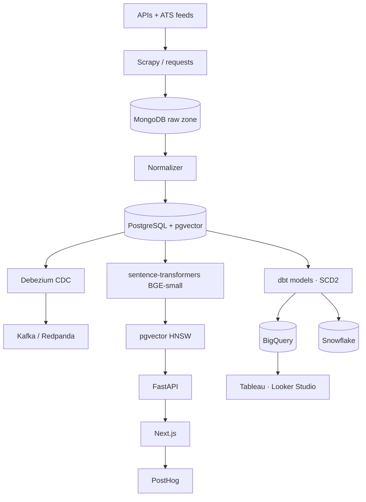

# JobAtlas

[](https://github.com/ayushgupta07xx/JobAtlas/actions/workflows/ci.yml)
[](LICENSE)
[](https://www.python.org/)

> Unified search across India's tech job boards. Upload a resume, get ranked matches.

The Indian tech job market is split across eight-plus portals — Naukri, Wellfound, Hirist, Instahyre, Indeed, LinkedIn, Adzuna, Jobicy. Each has its own search, its own filters, its own quirks. A senior backend engineer looking for a role in Bangalore opens five tabs and pastes the same query into each. The result is dozens of overlapping postings and no good way to compare.

JobAtlas aggregates these sources into one searchable, deduplicated index. Drop in a resume and the matcher ranks postings by semantic similarity to your experience, not keyword overlap alone.

## Live

- **India Tech Job Market** (Tableau) — salary by city & role, skill-demand heatmap, hiring velocity, top companies: https://public.tableau.com/app/profile/ayush.gupta3056/viz/JobAtlas/Dashboard1
- **Salary by Experience** (Tableau) — average advertised salary across experience bands (INR): https://public.tableau.com/app/profile/ayush.gupta3056/viz/SalarybyExperienceINR/Dashboard1
- **Executive KPIs** (Looker Studio) — jobs indexed, freshness, dedup rate, match latency: https://lookerstudio.google.com/s/iStvfIBy3lE
- **Web app** — _add Vercel URL_
- **API** — _add Hugging Face Spaces URL_

## What it does

Type a query and JobAtlas returns deduplicated, salary-normalized, freshness-ranked postings from every connected source at once. Upload a resume and `sentence-transformers` embeds it, pgvector finds the nearest postings, and each result carries a match score reflecting how closely your skills and experience overlap the role.

## By the numbers

- **9,000+** active, deduplicated India tech postings, refreshed daily
- **41** dbt models on a star-schema warehouse materialized to **both BigQuery and Snowflake**, with **SCD Type 2** on the job dimension
- Semantic resume → job matching with **~6 ms p95** vector retrieval (200-candidate pool, pgvector HNSW)
- Required-experience parsed from posting text to drive salary-by-experience analysis
- MinHash deduplication across sources (`title + company + city` signature)

## Sources

Volume is met through official and partner APIs and open ATS feeds. Direct scrapers are API-first and gated by each site's `robots.txt`/ToS — blocked sources fall back to APIs rather than escalating around bot protection.

| Source | Method | Notes |
|---|---|---|
| Adzuna India | Official API | Primary volume |
| Jobicy | Official API | Remote-focused |
| The Muse | Official API | India tech roles |
| Greenhouse / Lever / Ashby | Public ATS feeds | Per-company boards (original postings) |
| RemoteOK / Remotive | Official API | India-eligible remote |
| Naukri / Wellfound / Hirist / Instahyre | Scrape (roadmap) | robots.txt-respecting, best-effort |

## How it works



Raw payloads land in MongoDB, the normalizer writes a typed `staging.jobs` in Postgres, dbt builds a layered star schema into BigQuery and Snowflake in parallel, and resume matching runs against a pgvector HNSW index of `BGE-small-en-v1.5` embeddings. Change data capture streams through Debezium → Kafka; orchestration is Airflow. Full diagram and rationale in [`docs/architecture.md`](docs/architecture.md) and [`docs/decisions.md`](docs/decisions.md).

## Tech stack

| Layer | Tools |
|---|---|
| Ingestion | Scrapy, Playwright, `requests`, official APIs (Adzuna, Jobicy, The Muse, ATS feeds) |
| Storage | PostgreSQL 16 + pgvector, MongoDB, Cloudflare R2 (Parquet) |
| Streaming / CDC | Debezium, Kafka (Redpanda) |
| Orchestration | Apache Airflow |
| Transformation | dbt (BigQuery + Snowflake + Postgres adapters), Great Expectations |
| Warehouse | BigQuery, Snowflake |
| ML | sentence-transformers (BGE-small, 384-dim), pgvector HNSW |
| Backend / Frontend | FastAPI, Next.js 14, Tailwind, Recharts |
| Analytics | PostHog, Tableau Public, Looker Studio |
| Infra / CI | Terraform, Docker, GitHub Actions, Trivy |

## Local setup

Prerequisites: Python 3.11, Docker, Docker Compose v2.

```bash
git clone https://github.com/ayushgupta07xx/JobAtlas.git
cd JobAtlas
python3.11 -m venv .venv && source .venv/bin/activate
pip install -e ".[dev]"
pre-commit install
cp .env.example .env
docker compose up -d
```

## Repo layout

```
apps/            FastAPI backend, Next.js frontend, normalizer service
scrapers/        one spider per source
orchestration/   Airflow DAGs (scrape, embeddings, dedup)
streaming/       Debezium connectors + Kafka consumer
warehouse/       dbt project (staging / intermediate / marts, snapshots), Great Expectations
embeddings/      BGE-small embedding generator
infra/terraform/ GCP, Snowflake, Vercel, PostHog modules
analysis/r/      salary regression notebook
docs/            architecture, decisions (ADRs), business docs, dashboards
```

## Design

Low-fidelity wireframes for the three user segments — fresh graduate, career switcher, and senior hire — plus the recruiter benchmarking flow are in Figma:

**[JobAtlas — Wireframes (Figma)](https://www.figma.com/design/Dzl2dFyb8HC5kgCXShw3Oc/JobAtlas-%E2%80%94-Wireframes?node-id=4-2&t=1wUhvodBKDhRevtv-1)**

Flows covered: unified search & results, resume-to-job matching, salary & skill intelligence, job detail, and recruiter company view.

## License & legal

Apache 2.0. Scraping practices documented in [`LEGAL.md`](LEGAL.md). Non-commercial.
