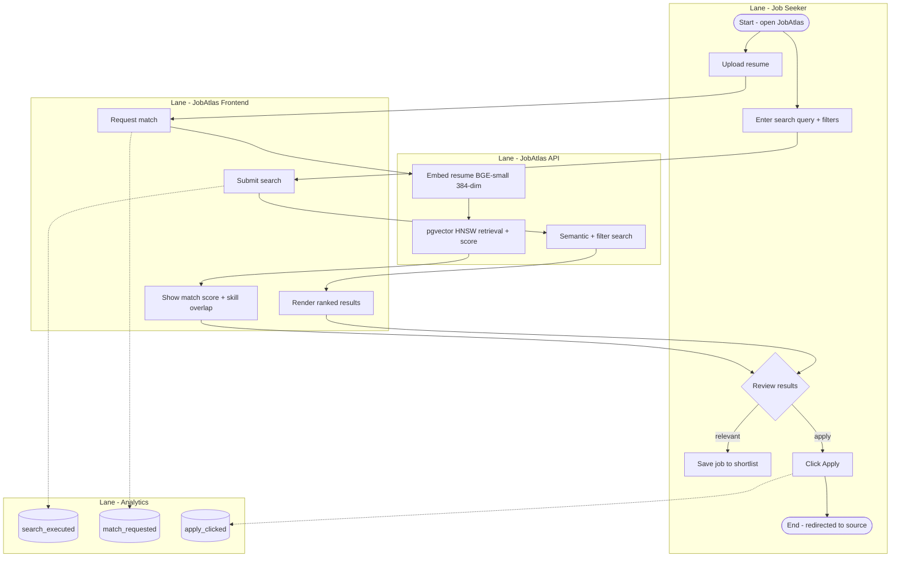
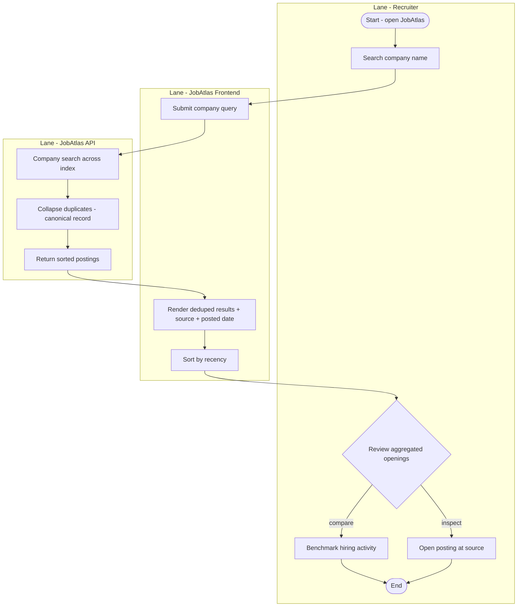
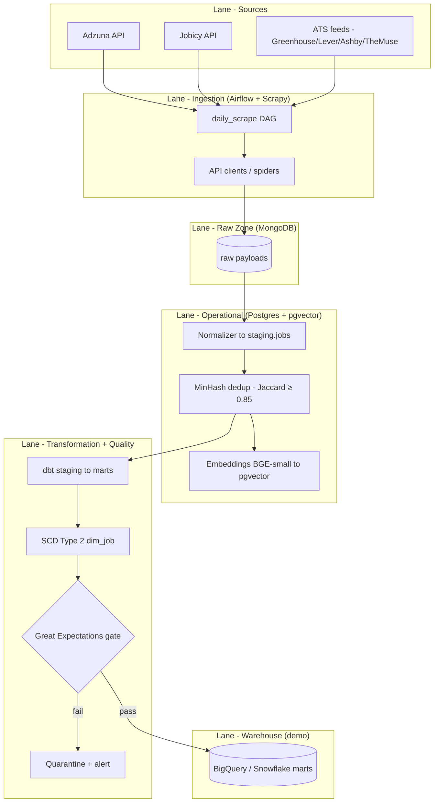

# JobAtlas — Process Maps

BPMN-style swim-lane diagrams for the three core flows: the job-seeker journey, the recruiter journey, and the scrape-to-warehouse data flow. Mermaid has no native BPMN pool/lane element, so each lane is represented as a labelled `subgraph`. Solid arrows are process flow; dotted arrows are analytics events.

---

## 1. Job-seeker journey

How a seeker (Anjali / Rohit / Sneha) moves from arrival to a matched application, across the frontend, API and analytics.

---

## 2. Recruiter journey

How a recruiter benchmarks a company's hiring by searching one name and receiving all aggregated, deduplicated openings.

---

## 3. Scrape-to-warehouse data flow

How postings move from source to warehouse: ingestion, raw landing, normalisation, dedup, embeddings, transformation, and a quality gate.

