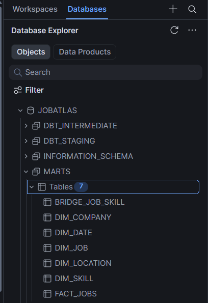
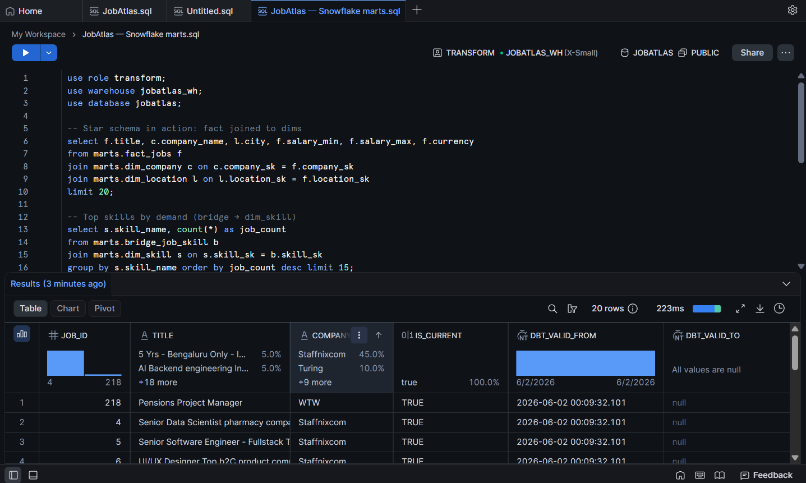

# Multi-Warehouse Deployment

JobAtlas runs the same dbt project against multiple warehouses from one codebase. Postgres (Neon) is both the development warehouse and the free-forever production target; Snowflake is a parallel deployment demonstrated during a 30-day trial; BigQuery was built and verified during the GCP demo window (identical star schema + SCD2, 502/264 row parity, all data tests green), then torn down per the per-cycle protocol.

## One project, multiple targets

`profiles.yml` defines `postgres`, `snowflake`, and `bigquery` targets. Models are **target-gated** so the identical DAG materializes everywhere:

- **Postgres** reads the live `staging.jobs` source and unnests the `skills` array natively (`cross join lateral unnest`).
- **Snowflake / BigQuery** read CSV **seeds** instead of the live source (those warehouses have no Postgres connection), and use dialect-appropriate date functions (`dayofweek` / `dayname` vs `extract(dow)` / `to_char(..., 'Day')`).
- `stg_jobs_embeddings` is disabled off-Postgres — the 384-dim pgvector embeddings live only in Postgres and are read directly by the API.

On a fresh warehouse, build with the DAG-ordered command so seeds, models, the snapshot, dependent models, and tests run in dependency order:

```bash
dbt build --target snowflake
```

## Parity

The same star schema and SCD Type 2 dimension build identically on both warehouses, and all 28 dbt tests pass on each:

| Object | Rows |
|---|---|
| fact_jobs | 502 |
| bridge_job_skill | 264 |
| dim_company | 266 |
| dim_location | 52 |
| dim_skill | 45 |
| dim_date | 1461 |
| dim_job_snapshot (SCD2) | 502 |




## Snowflake setup

A dedicated `TRANSFORM` role and an X-SMALL, auto-suspend-60s warehouse (`JOBATLAS_WH`) keep trial credit from bleeding between sessions. Setup SQL is run once in a Snowsight worksheet (role, warehouse, database, and schema grants).

## Seeds

`jobs_seed.csv` and `job_skills_seed.csv` are **not committed** — they hold scraped job content and `LEGAL.md` is no-redistribution. Regenerate both from a populated local Postgres:

```bash
docker compose exec -T postgres psql -U "$POSTGRES_USER" -d "$POSTGRES_DB" -c "\copy (select id, raw_id, source, source_job_id, source_url, title, company, city, state, country, salary_min, salary_max, currency, posted_date, translate(coalesce(description,''), chr(10)||chr(13)||chr(9), '   ') as description, content_hash, is_active, is_duplicate, dedup_group_id, scraped_at, created_at, updated_at from staging.jobs where coalesce(is_active,true) and not coalesce(is_duplicate,false)) to stdout with (format csv, header)" > warehouse/dbt_project/seeds/jobs_seed.csv

docker compose exec -T postgres psql -U "$POSTGRES_USER" -d "$POSTGRES_DB" -c "\copy (select j.id as job_id, lower(trim(s.skill)) as skill_name from staging.jobs j cross join lateral unnest(j.skills) as s(skill) where coalesce(j.is_active,true) and not coalesce(j.is_duplicate,false) and s.skill is not null and trim(s.skill) <> '') to stdout with (format csv, header)" > warehouse/dbt_project/seeds/job_skills_seed.csv
```

## Production note

The free-forever production stack runs on Postgres (Neon) — not Snowflake or BigQuery. The warehouse targets are an architectural demonstration; the dbt code lets anyone reproduce them on their own account.
