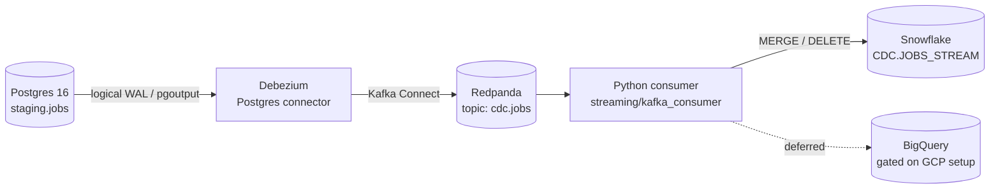

# Streaming Architecture — Change Data Capture

JobAtlas keeps its analytical warehouse in step with the operational database
in near-real-time using log-based Change Data Capture (CDC). Every row-level
change to `staging.jobs` in Postgres is captured from the write-ahead log and
streamed to the warehouse within seconds — no polling, no dual writes.

## Pipeline



## How it works

1. **Postgres** runs with `wal_level=logical`. A publication `jobatlas_cdc_pub`
   exposes `staging.jobs`, and `REPLICA IDENTITY FULL` ensures update and delete
   events carry the full previous row image (before -> after).
2. **Debezium** (Postgres connector, `pgoutput` plugin) runs on a Kafka Connect
   worker against the existing Redpanda broker. It performs an initial snapshot
   of the table, then tails the WAL through a replication slot (`jobatlas_cdc`).
3. A `RegexRouter` transform renames the default topic `cdc.staging.jobs` to
   **`cdc.jobs`**. Records are serialized as schema-less JSON.
4. The **consumer** (`streaming/kafka_consumer/consumer.py`) reads `cdc.jobs`,
   decodes the Debezium envelope (`op` = r/c/u/d), batches the changes, and
   applies them to `JOBATLAS.CDC.JOBS_STREAM` via a staged `MERGE` (upserts) and
   `DELETE` (tombstones). Offsets are committed only after a successful write,
   giving at-least-once delivery with idempotent, key-based merges.

## Key configuration decisions

| Concern | Choice | Why |
|---|---|---|
| Decoding plugin | `pgoutput` | Built into Postgres 16; no extra extension |
| Topic naming | RegexRouter -> `cdc.jobs` | Stable topic, independent of source schema |
| Serialization | JSON, schemas disabled | No Schema Registry dependency for the sink |
| Decimal handling | `decimal.handling.mode=double` | `numeric` salaries arrive as plain numbers, not base64 |
| Replica identity | `FULL` | Before-images available for change auditing |
| Delivery | Manual offset commit after sink write | At-least-once; merges are idempotent on `id` |

## Warehouse landing table

`JOBATLAS.CDC.JOBS_STREAM` holds the analytic subset of each job plus CDC
metadata (`cdc_op`, `cdc_ts_ms`, `synced_at`). Large or non-analytic source
columns (description, skills, MinHash signature, embedding) are deliberately
excluded — this is a change-tracking landing zone, not a full table mirror.

## Deferred

- **`cdc.companies` topic** — there is no operational `companies` table yet
  (`dim_company` is a dbt mart, rebuilt each run). It will be added once a
  `staging.companies` operational table exists.
- **BigQuery sink** — the consumer's sink is a single seam that can fan out to a
  second target; the BigQuery writer is gated on the GCP setup (budget alerts +
  ADC quota project) and is not wired yet.

## Running locally

```bash
docker compose up -d connect
set -a; source .env; set +a
envsubst < streaming/debezium/connectors/jobs-source.json | curl -s -X POST -H "Content-Type: application/json" --data @- http://localhost:8083/connectors
python streaming/kafka_consumer/consumer.py
```

The Snowflake warehouse (`JOBATLAS_WH`, X-Small) auto-suspends 60 seconds after
the last merge, so leaving the consumer idle does not consume credits.
